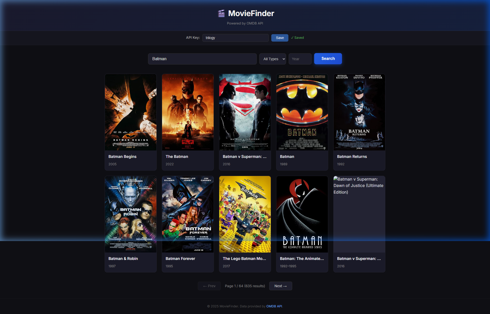
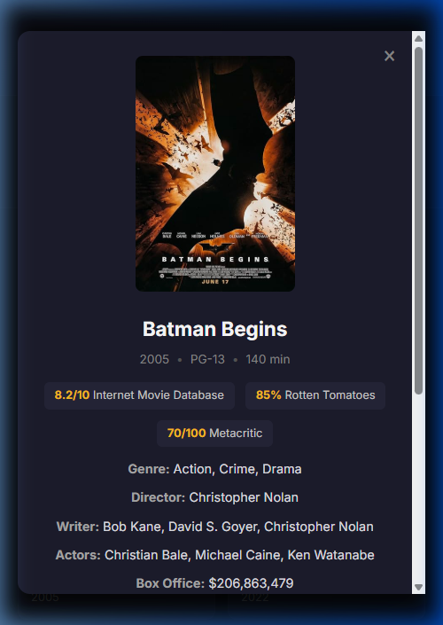

# MovieFinder – OMDB Movie Search

A single page web app that lets you search for movies using the [OMDB API](http://www.omdbapi.com/).  
Built with plain HTML, CSS and JavaScript — no frameworks, no build step.

## Live Demo

👉 **[https://emirgul-web.github.io/omdb-project/](https://emirgul-web.github.io/omdb-project/)**

## Features

- **Search** – Type a movie name and hit search. Results show up as a card grid.
- **Filters** – Optionally filter by type (movie / series / episode) and release year.
- **Detail View** – Click any card to see full details: plot, ratings, cast, box office etc.
- **Pagination** – Navigate through multi-page results easily.
- **Persistent Search** – Your last search is saved in LocalStorage, so if you refresh the page you pick up where you left off.
- **Error Handling** – Clear messages for invalid searches, network errors, missing API key and so on.
- **Responsive** – Works on desktops, tablets and phones.

## Getting Started

1. Go to [http://www.omdbapi.com/apikey.aspx](http://www.omdbapi.com/apikey.aspx) and get a **free API key**.
2. Clone this repo and open `index.html` in a browser (or use the deployed GitHub Pages link).
3. Paste your API key into the "API Key" field at the top and click **Save**.
4. Start searching!

## Project Structure

```
├── index.html       # main page
├── style.css        # all styles
├── app.js           # application logic
├── screenshots/     # readme images
└── README.md        # this file
```

## Deploying to GitHub Pages

1. Push this repo to GitHub.
2. Go to **Settings → Pages**.
3. Under "Source" select the `master` branch and `/root` folder.
4. Your site will be live at `https://<username>.github.io/omdb-project/`.

## Screenshots

### Search Results


### Movie Detail


## Notes

- The free OMDB plan allows 1 000 requests per day which is more than enough for this project.
- API responses are cached in memory while the page is open to avoid redundant requests.
- The app does not use any backend proxy; all calls go directly to the OMDB API from the browser.
